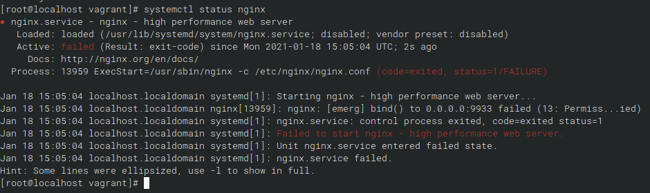
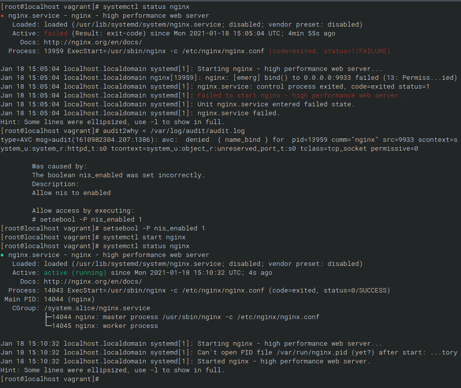
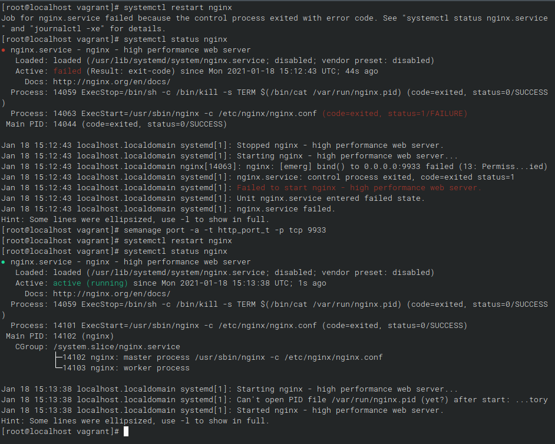
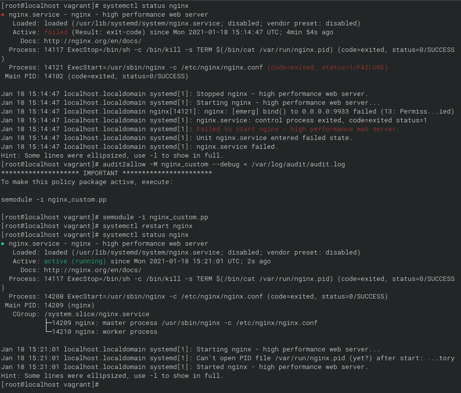
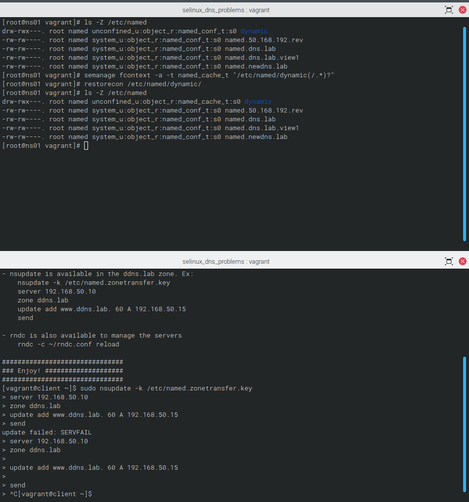

# Лабораторная работа 12.

## Цели работы

Работа с SELinux.

## Задачи

1. Запустить nginx на нестандартном порту 3-мя разными способами/
    - переключатели setsebool
    - добавление нестандартного порта в имеющийся тип
    - формирование и установка модуля SELinux

2. Обеспечить работоспособность приложения при включенном selinux.
    - Развернуть приложенный стенд https://github.com/mbfx/otus-linux-adm/tree/master/selinux_dns_problems
    - Выяснить причину неработоспособности механизма обновления зоны (см. README)
    - Предложить решение (или решения) для данной проблемы
    - Выбрать одно из решений для реализации, предварительно обосновав выбор
    - Реализовать выбранное решение и продемонстрировать его работоспособность

## Выполнение

---

### Запустить nginx на нестандартном порту 3-мя разными способами

1. Добавляем репозиторий nginx, устанавливаем пакет.
2. В `/etc/nginx/conf.d/default.conf` меняем порт на любой, отличный от стандартного. Пусть будет `9933`.
3. Запускаем nginx, получаем ошибку.

#### setsebool

1. Запускаем audit2why, отдав ему текущий `/var/log/audit/audit.log`.
2. В соответствии с рекомендацией выполняем `setsebool -P nis_enabled 1`.
3. Запускаем nginx. Проверяем что всё работает.

> Возвращаем атрибут на исходную командой `setsebool -P nis_enabled 0` и перегружаем nginx.

#### Добавление нестандартного порта

1. Добавляем нестандартный порт командой

    `semanage port -a -t http_port_t -p tcp 9933`

2. Перезапускаем nginx. Проверяем что всё работает.

> Возвращаем значения на исходную командой `semanage port -d -t http_port_t -p tcp 9933` и перегружаем nginx.

#### Формирование и установка модуля

1. Генерируем модуль для SELinux посредством audit2allow: `audit2allow -M nginx_custom --debug < /var/log/audit/audit.log`
2. Подгружаем его `semodule -i nginx_custom.pp`
3. Запускаем nginx. Проверяем что всё работает.

---

### Обеспечить работоспособность приложения при включенном selinux.

1. Повторяем кейс из README (выбран второй пункт) для того, чтобы получить необходимые записи в логах.
2. На ns01 смотрим в лог (сразу через `audit2why`):
        
        type=AVC msg=audit(1610987433.512:1342): avc:  denied  { create } for  pid=674 comm="isc-worker0000" name="named.ddns.lab.view1.jnl" scontext=system_u:system_r:named_t:s0 tcontext=system_u:object_r:etc_t:s0 tclass=file permissive=0

        Was caused by:
                Missing type enforcement (TE) allow rule.

                You can use audit2allow to generate a loadable module to allow this access.

    А т.е. проблема заключается в доступе к файлам. Ближайший файл с похожим наименованием лежит в `/etc/named/`. Страница `named_selinux` отсутствует на данном инстансе, но с кратким поиском выяснилось, что для `/etc/named` контекст должен быть установлен в `named_conf_t`.
    
    На момент разбора ситуации контекст в данном каталоге указан в `system_u:object_r:etc_t:s0`.
    
    Соответственно необходимо изменить контекст и крайне желательно сделать это изменение постоянным.

3. Выполняем `semanage fcontext -a -t named_conf_t "/etc/named(/.*)?"` и далее `restorecon -R /etc/named`.
4. Проверяем выполнение запроса, получаем ошибку. Теперь ругается на каталог `dynamic` с аналогичными симптомами. Логически предполагаем что каталог dynamic относится к `named_cache_t` и повторяем операцию уже для него.

        semanage fcontext -a -t named_conf_t "/etc/named/dynamic(/.*)?"
        restorecon -R /etc/named/dynamic

5. Повторяем отправку с клиентской части, ошибок более нет.

