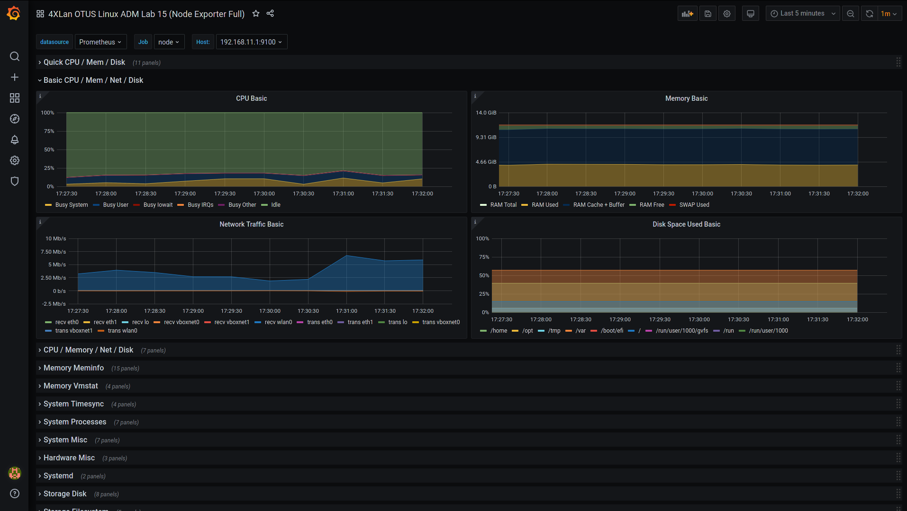

# Лабораторная работа 15.

## Цели работы

Настройка мониторинга.

## Задачи

1. Настроить дашборд с 4-мя графиками

    1) Память
    
    2) Процессор
    
    3) Диск
    
    4) Сеть

Настроить на одной из систем
- zabbix (использовать screen (комплексный экран))
- prometheus - grafana

---

## Выполнение

---
