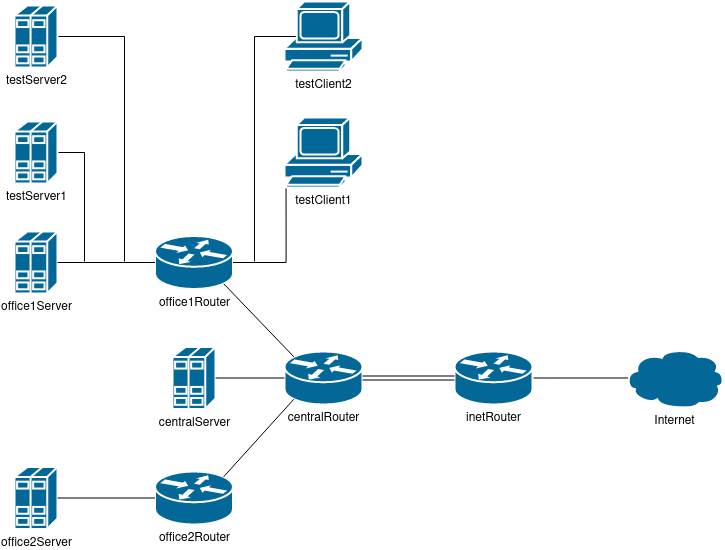

# Лабораторная работа 21.

## Цели работы

Настройка vlan и бондов.

## Задачи

В Office1 в тестовой подсети появляется сервера с доп. интерфесами и адресами в internal сети testLAN.

- testClient1 - 10.10.10.254
- testClient2 - 10.10.10.254
- testServer1 - 10.10.10.1
- testServer2 - 10.10.10.1



1. Необходимо развести вланами
```
testClient1 <-> testServer1
testClient2 <-> testServer2
```

2. Между centralRouter и inetRouter "пробросить" 2 линка (общая internal сеть) и объединить их в бонд
проверить работу c отключением интерфейсов.

---

## Выполнение

Файлы представлены в каталоге [cfg](./cfg).

---
