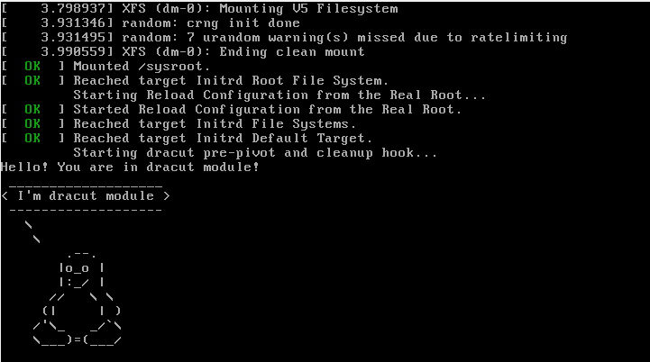

### 3. Добавить модуль в initrd

    [root@localhost ~]# mkdir /usr/lib/dracut/modules.d/01test
    [root@localhost ~]# vi /usr/lib/dracut/modules.d/01test/module-setup.sh
    [root@localhost ~]# vi /usr/lib/dracut/modules.d/01test/test.sh
    [root@localhost ~]# mkinitrd -f -v /boot/initramfs-$(uname -r).img $(uname -r)
    Creating: target|kernel|dracut args|basicmodules 
    dracut: Executing: /usr/bin/dracut -v -f /boot/initramfs-4.18.0-193.el8.x86_64.img 4.18.0-193.el8.x86_64
    dracut: dracut module 'modsign' will not be installed, because command 'keyctl' could not be found!
    dracut: dracut module 'busybox' will not be installed, because command 'busybox' could not be found!
    dracut: dracut module 'btrfs' will not be installed, because command 'btrfs' could not be found!
    dracut: dracut module 'dmraid' will not be installed, because command 'dmraid' could not be found!
    dracut: dracut module 'mdraid' will not be installed, because command 'mdadm' could not be found!
    dracut: dracut module 'stratis' will not be installed, because command 'stratisd-init' could not be found!
    dracut: dracut module 'cifs' will not be installed, because command 'mount.cifs' could not be found!
    dracut: dracut module 'iscsi' will not be installed, because command 'iscsi-iname' could not be found!
    dracut: dracut module 'iscsi' will not be installed, because command 'iscsiadm' could not be found!
    dracut: dracut module 'iscsi' will not be installed, because command 'iscsid' could not be found!
    dracut: 95nfs: Could not find any command of 'rpcbind portmap'!
    dracut: dracut module 'modsign' will not be installed, because command 'keyctl' could not be found!
    dracut: dracut module 'busybox' will not be installed, because command 'busybox' could not be found!
    dracut: dracut module 'btrfs' will not be installed, because command 'btrfs' could not be found!
    dracut: dracut module 'dmraid' will not be installed, because command 'dmraid' could not be found!
    dracut: dracut module 'mdraid' will not be installed, because command 'mdadm' could not be found!
    dracut: dracut module 'stratis' will not be installed, because command 'stratisd-init' could not be found!
    dracut: dracut module 'cifs' will not be installed, because command 'mount.cifs' could not be found!
    dracut: dracut module 'iscsi' will not be installed, because command 'iscsi-iname' could not be found!
    dracut: dracut module 'iscsi' will not be installed, because command 'iscsiadm' could not be found!
    dracut: dracut module 'iscsi' will not be installed, because command 'iscsid' could not be found!
    dracut: 95nfs: Could not find any command of 'rpcbind portmap'!
    dracut: *** Including module: bash ***
    dracut: *** Including module: systemd ***
    dracut: *** Including module: systemd-initrd ***
    dracut: *** Including module: test ***
    dracut: *** Including module: rngd ***
    dracut: *** Including module: i18n ***
    dracut: *** Including module: network-legacy ***
    dracut: *** Including module: network ***
    dracut: *** Including module: ifcfg ***
    dracut: *** Including module: prefixdevname ***
    dracut: *** Including module: dm ***
    dracut: Skipping udev rule: 64-device-mapper.rules
    dracut: Skipping udev rule: 60-persistent-storage-dm.rules
    dracut: Skipping udev rule: 55-dm.rules
    dracut: *** Including module: kernel-modules ***
    dracut: *** Including module: kernel-modules-extra ***
    dracut: *** Including module: kernel-network-modules ***
    dracut: *** Including module: lvm ***
    dracut: Skipping udev rule: 64-device-mapper.rules
    dracut: Skipping udev rule: 56-lvm.rules
    dracut: Skipping udev rule: 60-persistent-storage-lvm.rules
    dracut: *** Including module: resume ***
    dracut: *** Including module: rootfs-block ***
    dracut: *** Including module: terminfo ***
    dracut: *** Including module: udev-rules ***
    dracut: Skipping udev rule: 91-permissions.rules
    dracut: Skipping udev rule: 80-drivers-modprobe.rules
    dracut: *** Including module: biosdevname ***
    dracut: *** Including module: dracut-systemd ***
    dracut: *** Including module: usrmount ***
    dracut: *** Including module: base ***
    dracut: *** Including module: fs-lib ***
    dracut: *** Including module: microcode_ctl-fw_dir_override ***
    dracut:   microcode_ctl module: mangling fw_dir
    dracut:     microcode_ctl: reset fw_dir to "/lib/firmware/updates /lib/firmware"
    dracut:     microcode_ctl: processing data directory  "/usr/share/microcode_ctl/ucode_with_caveats/intel"...
    intel: model '', path ' intel-ucode/*', kvers ''
    intel: blacklist ''
    dracut:     microcode_ctl: intel: Host-Only mode is enabled and "intel-ucode/06-9e-0a" matches "intel-ucode/*"
    dracut:       microcode_ctl: intel: caveats check for kernel version "4.18.0-193.el8.x86_64" passed, adding "/usr/share/microcode_ctl/ucode_with_caveats/intel" to fw_dir variable
    dracut:     microcode_ctl: processing data directory  "/usr/share/microcode_ctl/ucode_with_caveats/intel-06-2d-07"...
    intel-06-2d-07: model 'GenuineIntel 06-2d-07', path ' intel-ucode/06-2d-07', kvers ''
    intel-06-2d-07: blacklist ''
    intel-06-2d-07: caveat is disabled in configuration
    dracut:     microcode_ctl: kernel version "4.18.0-193.el8.x86_64" failed early load check for "intel-06-2d-07", skipping
    dracut:     microcode_ctl: processing data directory  "/usr/share/microcode_ctl/ucode_with_caveats/intel-06-4f-01"...
    intel-06-4f-01: model 'GenuineIntel 06-4f-01', path ' intel-ucode/06-4f-01', kvers ' 4.17.0 3.10.0-894 3.10.0-862.6.1 3.10.0-693.35.1 3.10.0-514.52.1 3.10.0-327.70.1 2.6.32-754.1.1 2.6.32-573.58.1 2.6.32-504.71.1 2.6.32-431.90.1 2.6.32-358.90.1'
    intel-06-4f-01: blacklist ''
    intel-06-4f-01: caveat is disabled in configuration
    dracut:     microcode_ctl: kernel version "4.18.0-193.el8.x86_64" failed early load check for "intel-06-4f-01", skipping
    dracut:     microcode_ctl: processing data directory  "/usr/share/microcode_ctl/ucode_with_caveats/intel-06-55-04"...
    intel-06-55-04: model 'GenuineIntel 06-55-04', path ' intel-ucode/06-55-04', kvers ''
    intel-06-55-04: blacklist ''
    intel-06-55-04: caveat is disabled in configuration
    dracut:     microcode_ctl: kernel version "4.18.0-193.el8.x86_64" failed early load check for "intel-06-55-04", skipping
    dracut:     microcode_ctl: final fw_dir: "/usr/share/microcode_ctl/ucode_with_caveats/intel /lib/firmware/updates /lib/firmware"
    dracut: *** Including module: shutdown ***
    dracut: *** Including modules done ***
    dracut: *** Installing kernel module dependencies ***
    dracut: *** Installing kernel module dependencies done ***
    dracut: *** Resolving executable dependencies ***
    dracut: *** Resolving executable dependencies done***
    dracut: *** Hardlinking files ***
    dracut: *** Hardlinking files done ***
    dracut: Could not find 'strip'. Not stripping the initramfs.
    dracut: *** Generating early-microcode cpio image ***
    dracut: *** Constructing GenuineIntel.bin ****
    dracut: *** Constructing GenuineIntel.bin ****
    dracut: *** Store current command line parameters ***
    dracut: *** Creating image file '/boot/initramfs-4.18.0-193.el8.x86_64.img' ***
    dracut: *** Creating initramfs image file '/boot/initramfs-4.18.0-193.el8.x86_64.img' done ***
    [root@localhost ~]# lsinitrd -m /boot/initramfs-$(uname -r).img | grep test
    test
    [root@localhost ~]# reboot

